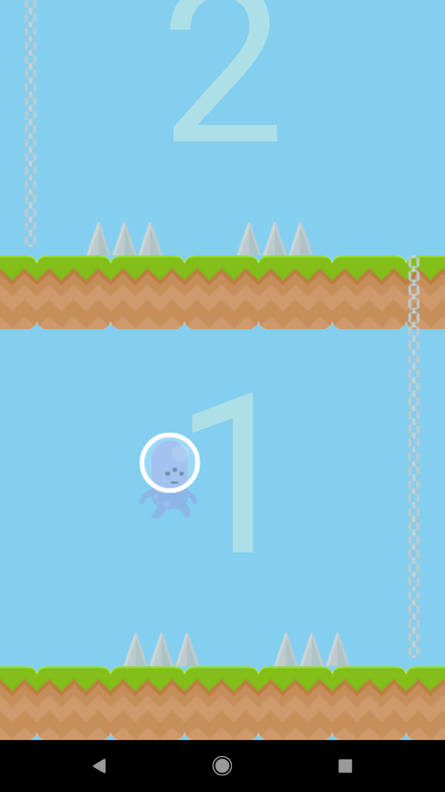

|  |<h1>Climby Climb</h1>| 
| :---         |     :---:      | 

## Overview

[Climby Climb](https://play.google.com/store/apps/details?id=com.game.thanu.gameapp) is an Android game where the objective is to avoid obstacles on each level and try to get a high score! 

## Screenshots

## Features

- Free to play
- Jump spikes, run away from ghosts and duck under bees to avoid falling from your doom!
- Awesome time-killer
- Easy to learn and fun to play

## Technologies Used

- [Android Studio](https://developer.android.com/studio) - IDE used to build the game
- [Java](https://www.java.com/en/download/) - Programming language used (Created the game when I was new to programming, so I used Java instead of Kotlin)