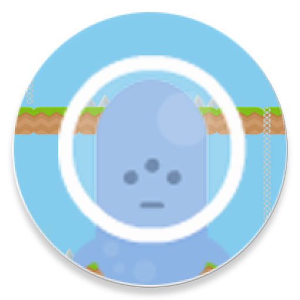
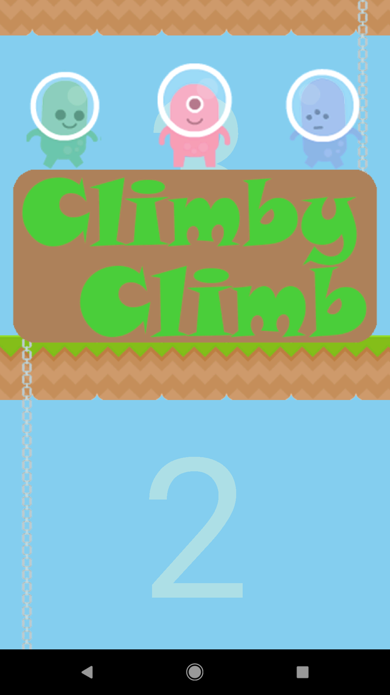
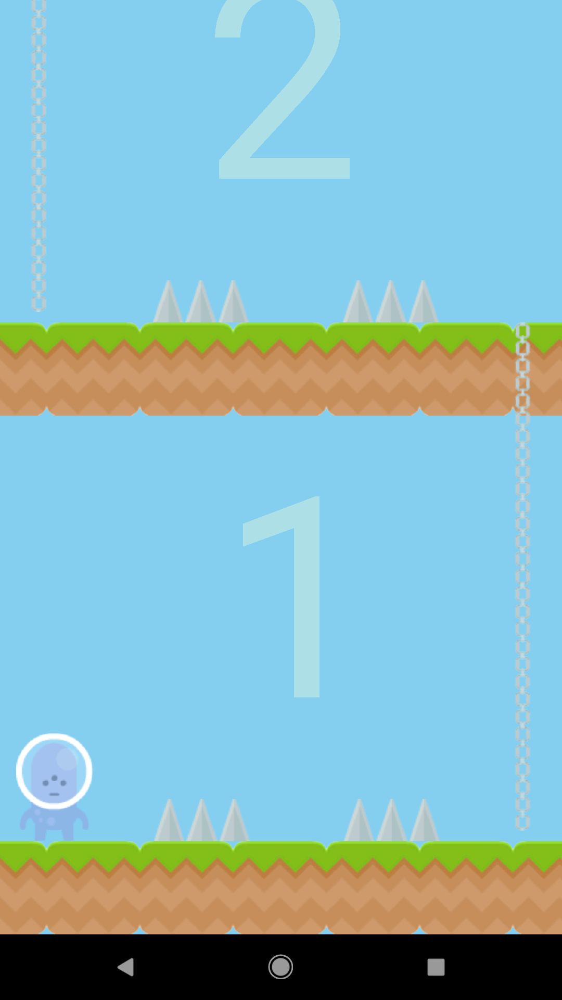
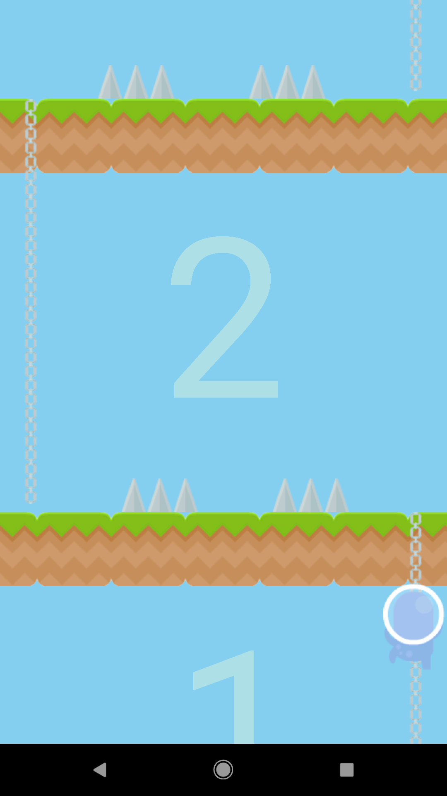
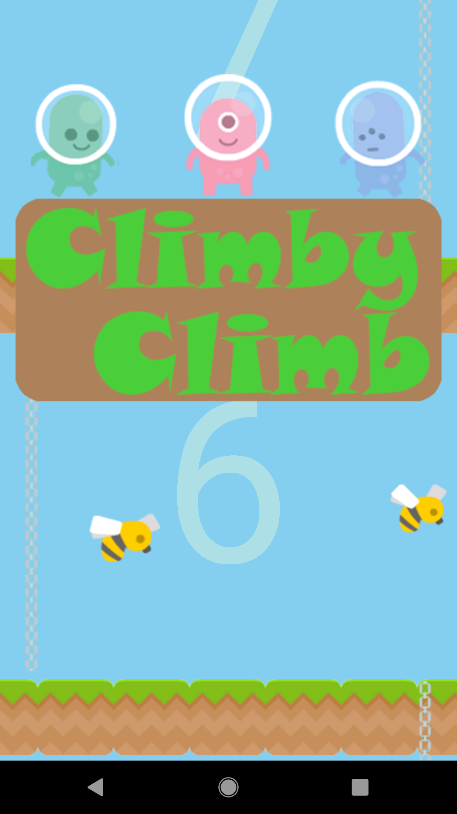
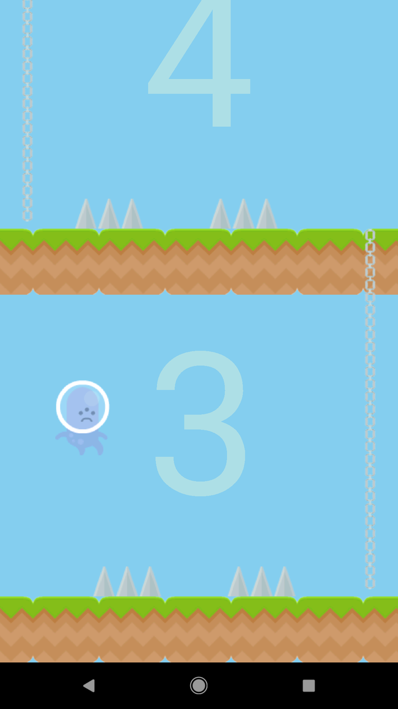
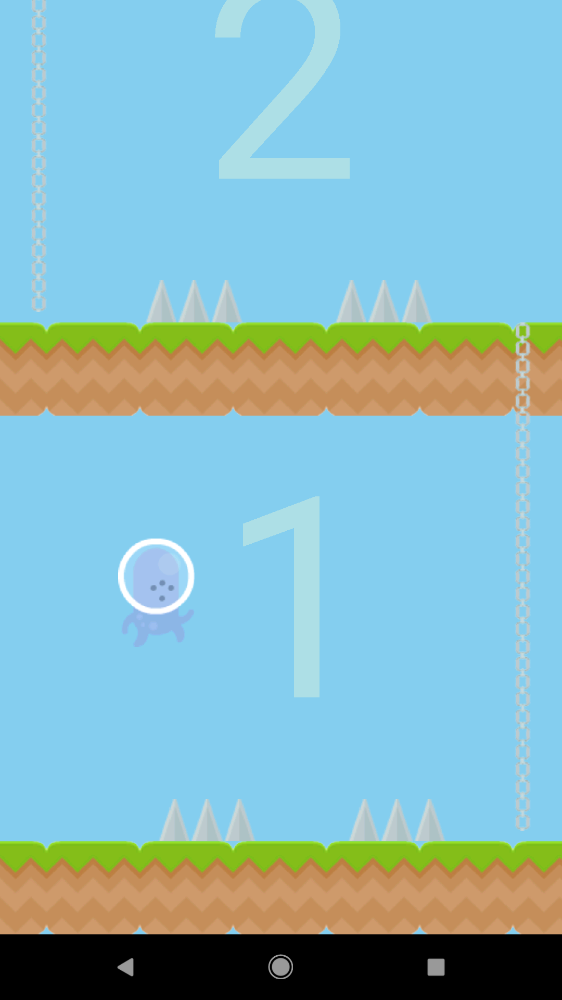
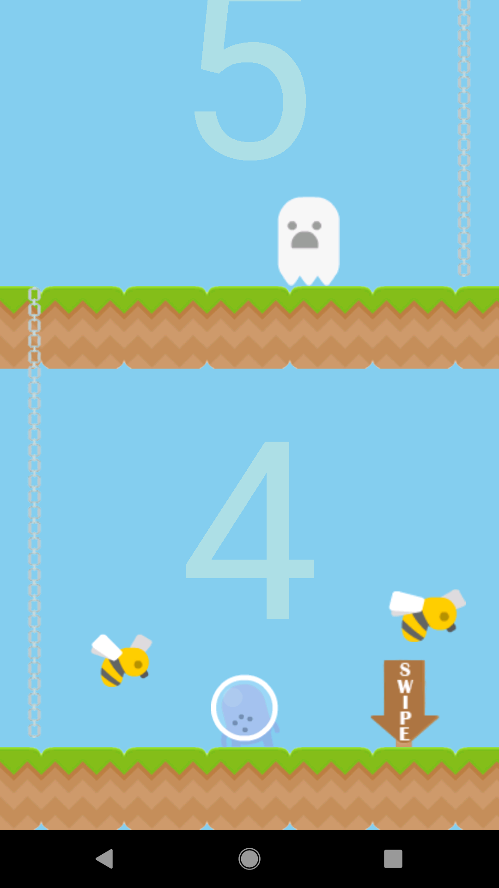
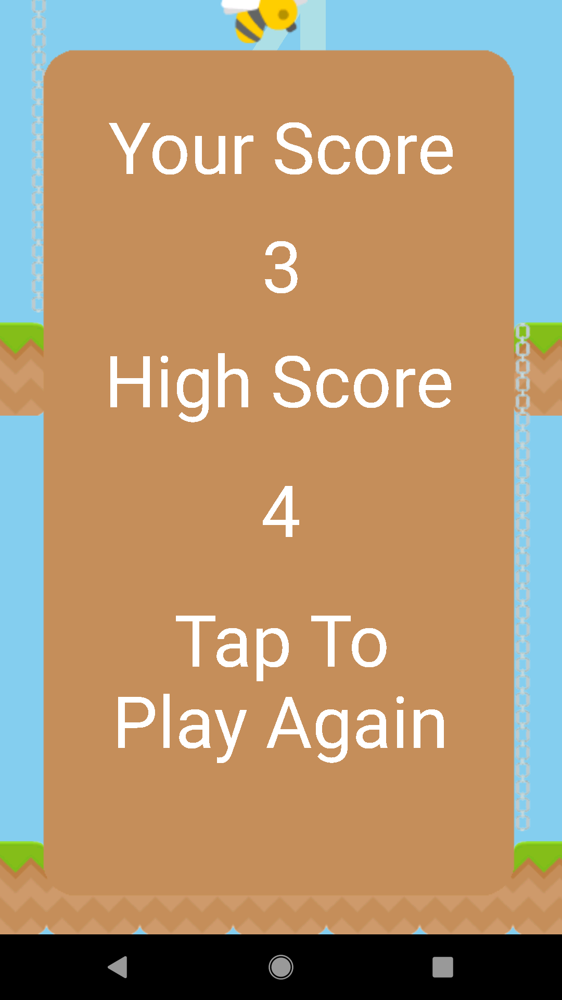

|  |<h1>Climby Climb</h1>| 
| :---         |     :---:      | 

## Table of Contents

- [Overview](#Overview)
- [Screenshots](#Screenshots)
- [How to Play on Your Device](#how-to-play-on-your-device)
- [Features](#Features)
- [Cool Things about the App](#cool-things-about-the-app)
- [Technologies Used](#technologies-used)
- [Acknowledgements](#acknowledgements)

## Overview

[Climby Climb](https://play.google.com/store/apps/details?id=com.game.thanu.gameapp) is an Android game where the objective is to avoid obstacles on each level and try to get a high score! 

## Screenshots

 
 
 
 

## How to Play on Your Device

You can simply click on the hyperlink of Climby Climb in the [Overview](#Overview) section or [click here](https://play.google.com/store/apps/details?id=com.game.thanu.gameapp) to download the app from the Google Play Store. 

Alternatively, you can clone this repository and open it up in Android Studio. Then simply load the app to you Android device by clicking the green play button on the top-right side of the IDE (assuming no compilation erros :D).

## Features

- Free to play
- Jump spikes, run away from ghosts and duck under bees to avoid falling from your doom!
- Awesome time-killer
- Easy to learn and fun to play

## Cool Things about the App

- Utilized multithreaded operations such as AsyncTask, Runnables and Threads to spawn obstacles
- Developed the app’s UX by identifying user-friendly controls through player feedback and surveys
- Applied object-oriented programming principles to create randomly generated levels
- Scaled and optimized the game to be functional across all displays
- Implemented 10 unique animations using open-source software for the game’s character and obstacles

## Technologies Used

- [Android Studio](https://developer.android.com/studio) - IDE used to build the game
- [Java](https://www.java.com/en/download/) - Programming language used (Created the game when I was new to programming, so I used Java instead of Kotlin)

## Acknowledgements

- Thanks to [Platformer Art by Kenney Vleugels](www.kenney.nl) for allowing me to use his sprites/images
